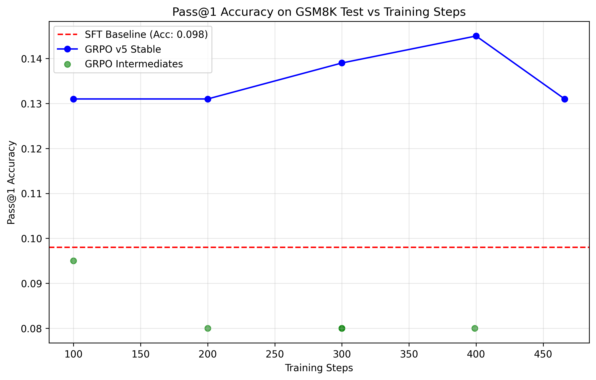

# Nanochat GRPO Testing

This repository contains research and implementations primarily focused on testing and optimizing Group Relative Policy Optimization (GRPO) for the nanochat language model on reasoning tasks (GSM8K).

## Experiment Variations

The project involves testing iterative improvements to a standard GRPO implementation. We aimed to stabilize learning, prevent reward collapse, and improve sample efficiency. 

The progression of scripts is as follows:

### 1. `grpo_script.py` (v1: Baseline)
*   **Approach:** Basic REINFORCE-style policy gradient with advantages computed as $A = r - \mu$.
*   **Settings:** 
    *   `device_batch_size=4`, `num_samples=8`.
    *   Learning rates: `embedding_lr=0.2`, `matrix_lr=0.02`, `unembedding_lr=0.004`.
    *   No gradient accumulation across multiple mini-batches.

### 2. `grpo_minibatch_script.py` (v4: Mini-Batch PPO Style)
*   **Approach:** Introduced PPO-style clipping and mini-batching for gradient accumulation.
*   **Settings:**
    *   `mini_batch_size=32`, `num_mini_epochs=1`, `clip_eps=0.2`.
    *   Normalized advantages $A = (r - \mu) / \sigma$. 
    *   This version suffered from instability when action spaces generated very low variance in rewards (e.g., when all outputs are incorrect, $\sigma \to 0$ leading to extreme advantages).

### 3. `grpo_minibatch_script_v2.py` (v5: Stability Fixes)
*   **Approach:** Implemented critical stability improvements.
*   **Settings:**
    *   **LR Reduction:** Decreased all learning rates by 10x (`embedding_lr=0.02`, `matrix_lr=0.002`, `unembedding_lr=0.0004`).
    *   **Cosine Schedule:** Added a linear warmup (50 steps) followed by a cosine decay to 10% of peak LR.
    *   **Token-Level PPO:** Shifted from sequence-level to token-level log probabilities.
    *   **Clipping:** Advantage clipping (`adv_clip=5.0`) and Gradient clipping (`max_grad_norm=1.0`).
    *   **Updates:** Increased `num_mini_epochs` from 1 to 4.

### 4. `grpo_minibatch_script_v3.py` (v6: GAPO Style)
*   **Approach:** Refined hyperparameters based on v5 performance, leaning closer to DeepSeek's GAPO approach.
*   **Settings:**
    *   **LR Adjustment:** Raised learning rates to an intermediate level (5x reduction from base rather than 10x).
    *   **GAPO Advantages:** Reverted to $A = r - \mu$ without standard deviation normalization to avoid the $\sigma \to 0$ explosion.
    *   **Sample Efficiency:** Increased samples per prompt from 8 to 16.
    *   **Batching:** Increased `mini_batch_size` to 64 but reduced `num_mini_epochs` to 2.
    *   **Clipping:** Relaxed gradient clipping (`max_grad_norm=5.0`) and advantage clipping (`adv_clip=10.0`).

## Quantitative Results

The models were evaluated on the GSM8K test and train splits. Below are the consolidated insights and learning curves based on checkpoint evaluations.

### Learning Curve (Pass@1 Test Accuracy)

The learning curves below demonstrate the training progression for intermediate validation steps. The `SFT Baseline` achieved `9.8%` `pass@1` accuracy at step 650.

#### Validation Pass@1 Data Table (Test Split)

| Model / Run Type | Step | Accuracy |
| :--- | :--- | :--- |
| **SFT Baseline** | 650 | **0.098** |
| RL Base (v4) | 100 | 0.095 |
| RL Base (v4) | 200 | 0.080 |
| RL Base (v4) | 399 | 0.080 |
| **RL v5 Stable** | 100 | 0.131 |
| **RL v5 Stable** | 200 | 0.131 |
| **RL v5 Stable** | 300 | 0.139 |
| **RL v5 Stable** | 400 | **0.145** |
| **RL v5 Stable** | 466 | 0.131 |

## Key Findings & Research Notes

1.  **Advantage Calculation is Fragile:** Normalizing advantages using standard deviation ($A = (r - \mu) / \sigma$) can cause extreme gradients when the model converges to a single behavior (e.g., failing consistently on early steps). Switching to GAPO-style advantages ($A = r - \mu$) as in script version 6 proved much more stable.
2.  **Learning Rate Sensitivity:** Standard SFT learning rates were far too high for RL fine-tuning. A 10x reduction (v5) stabilized training significantly, preventing immediate reward collapse. Iteration v6 strikes a balance with a 5x reduction, maintaining learning velocity without exploding.
3.  **Token-Level vs Sequence-Level:** Moving to token-level log probabilities (PPO masking padding tokens) alongside properly tuned `clip_eps` was vital for stability over multiple mini-epochs. Sequence-level PPO is numerically unstable when sequences are long.
4.  **Overall Efficacy:** The `RL v5 Stable` training run showed a clear ability to exceed the SFT baseline, improving `pass@1` on GSM8K from `~9.8%` to `14.5%`. This demonstrates that the stable GRPO variant successfully pushes the primary mode of the distribution toward correctness without immediately collapsing. Future tests with speculative decoding will focus on leveraging this tightened trajectory distribution.
